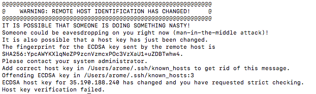
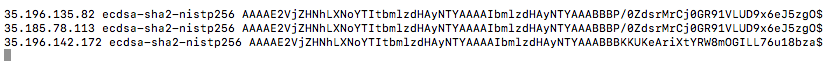
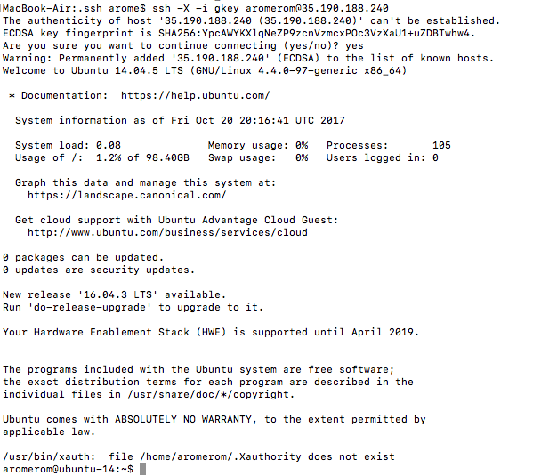

# Troubleshooting: Remote Host Identity Has Changed (Mac)

It has come to my attention that several mac users are getting a warning message that indicates the remote host's identity has changed when they try to ssh into their instance. The warning can be seen in the screenshot below. 



This warning message actually happens when we don't reserve a static IP address for our Google Compute Engine instances and keep creating new instances. This is indicated by the line which states "It is also possible that a host key has just been changed." We are told to add the correct key in our `known_hosts` file and that the offending IP address is `35.190.188.240`. 

So we can fix this by switching into the `.ssh` directory and opening up the `known_hosts` file in our favorite text editor: 
```
cd ~/.ssh
nano known_hosts
```

We should now see something that looks similar to the following screenshot: 


Now we need to find the "offending" host key. Looking at the screenshot, we can see that it is the last one (note that it should be the i-th one in the list where i is the number given in the first screenshot where it states the offending key. I moved this to the end to make the point clearer).

After deleting the offending host key, our file should look as follows: 



If you have followed up until now, you can exit the editor and save your changes. Then, change back into your root directory and try to ssh into your instance again: 

```
cd ~
ssh -X -i ~/.ssh/gkey [username]@35.190.188.240
```

Note this assumes your key is saved in the `~/.ssh` directory and shows the offedning host for this example. You will have to use the proper IP for your corresponding instance. When you try to ssh into your instance, it should look similar to this: 



I hope this guide helps. Feel free to let me know if you have any other errors. 
